# Bike Sales Analysis - India

## Overview
This project analyzes a dataset of motorcycle sales in India to uncover insights into pricing patterns, brand market share, and resale value predictions. The analysis includes comprehensive data preparation, exploratory data analysis with visualizations, outlier detection, and a predictive model for estimating bike resale values.

## Features
- Data cleaning and missing value handling
- Feature engineering to derive valuable insights
- 14 different visualizations exploring various aspects of the data
- Outlier detection using IQR method
- Linear regression model to predict bike resale prices
- Interactive prediction functionality

## Dataset
The dataset (`bike_sales_india.csv`) contains information about motorcycle sales in India, including:
- Brand and model information
- Price and resale price
- Engine capacity and mileage
- Year of manufacture and registration
- Location data (state and city tier)
- Usage patterns (average daily distance)
- Insurance and ownership status

## Requirements
```
pandas
numpy
matplotlib
seaborn
scikit-learn
```

## Data Preparation
The code handles missing values in columns like average daily distance, brand, model, and fuel type by replacing them with means or modes as appropriate. It also creates several derived features:

- Bike Age: Calculated from year of manufacture
- Is_New: Binary flag for newly manufactured bikes
- Is_Insurance_Expired: Binary flag based on insurance status
- Price_per_CC: Cost per engine capacity unit
- Resale_Ratio: How much value the bike retains
- Avg_KM_per_Year: Average annual distance traveled

## Exploratory Data Analysis

### 1. State-wise Sales Count
Bar chart showing distribution of bike sales across different states.

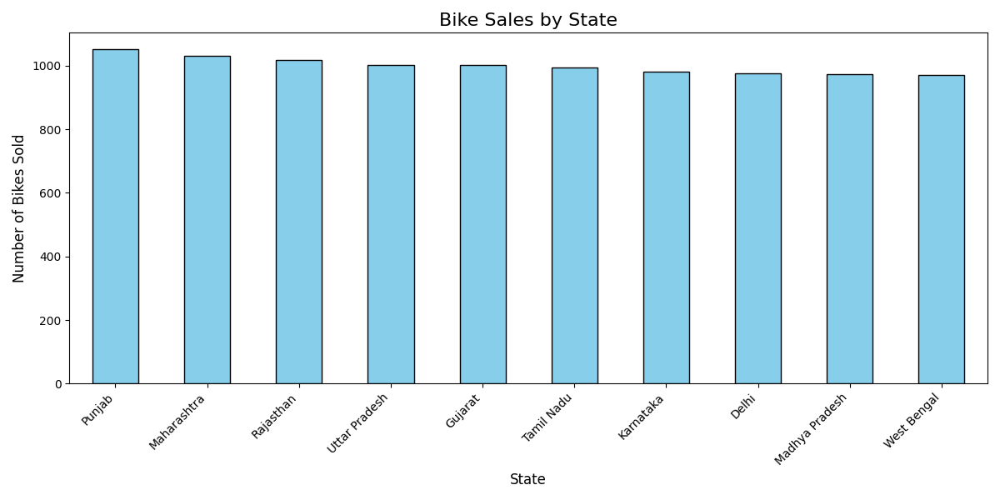

**Objective**: To identify high and low-performing regions in terms of sales volume.

### 2. Average Daily Distance by Brand
Line plot comparing average daily usage across brands.

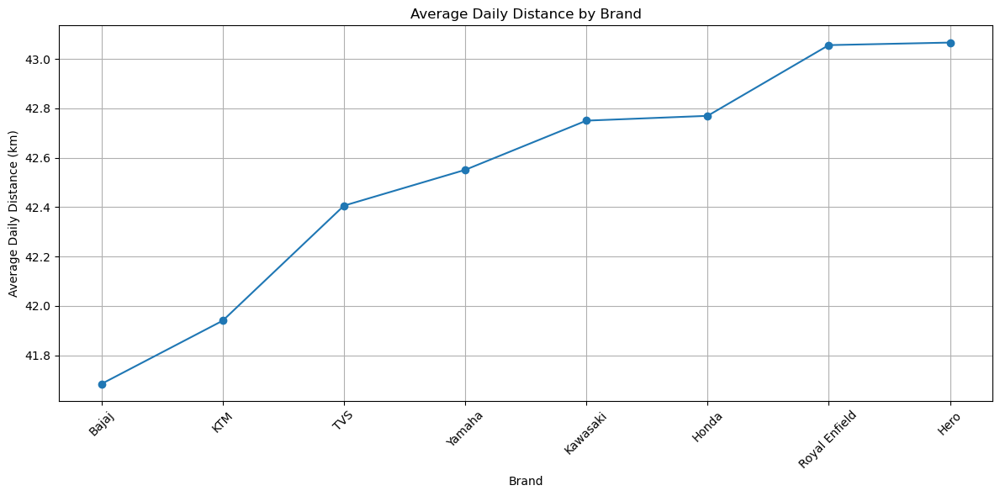

**Objective**: To compare how much bikes from different brands are used on average per day, indicating usage intensity and potentially brand reliability or preference for long distances.

### 3. Brand Market Share
Pie chart illustrating each brand's market presence.

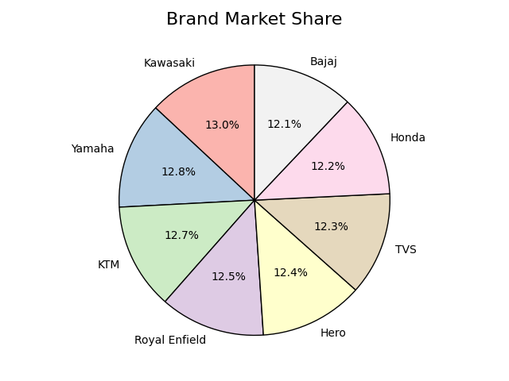

**Objective**: To illustrate each brand's share in the total number of bikes, providing a snapshot of the competitive landscape.

### 4. Distribution of Bike Prices
Histogram showing price distribution patterns.

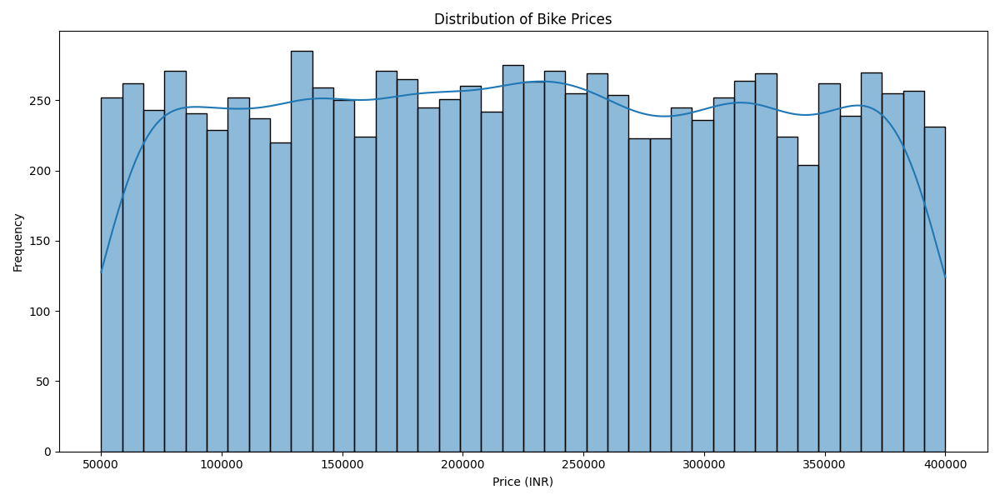

**Objective**: To understand the price distribution of bikes, identify pricing clusters, skewness, and potential outliers in the dataset.

### 5. Resale Ratio vs Bike Age
Box plot demonstrating how value retention changes with age.

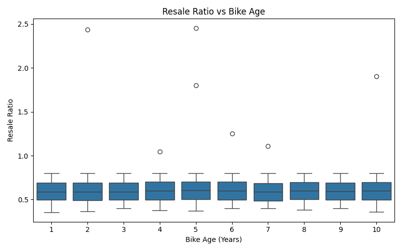

**Objective**: To show how the resale value of bikes (as a percentage of the original price) declines with age, helping analyze depreciation patterns.

### 6. Average Resale Price by Brand
Horizontal bar chart comparing brand resale values.

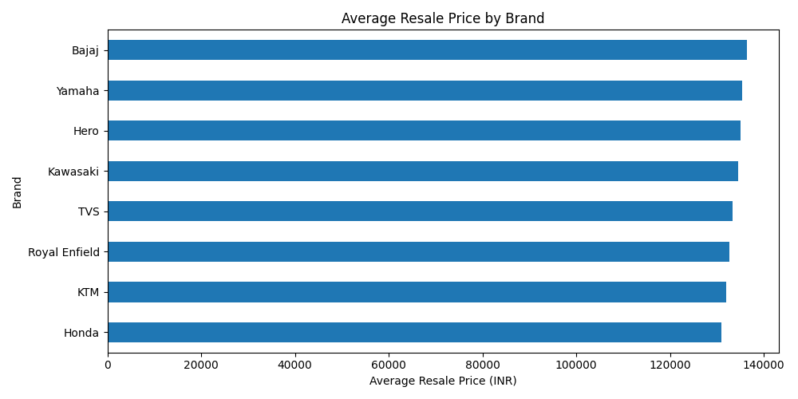

**Objective**: To compare the average resale prices among brands, indicating which brands retain more value in the secondary market.

### 7. Feature Correlation Heatmap
Correlation analysis between numeric variables.

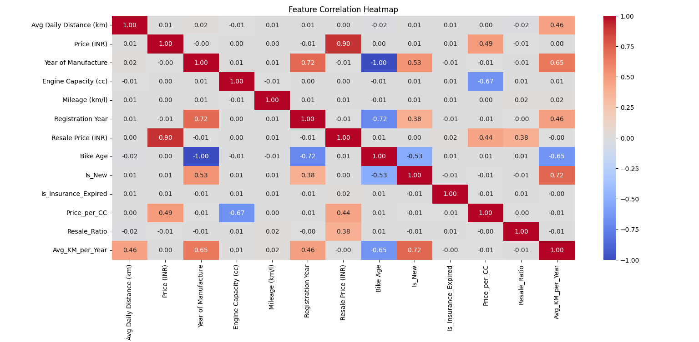

**Objective**: To show how different numeric features relate to each other (positive or negative correlation), aiding in feature selection and data understanding.

### 8. Insurance Status Count
Line plot showing distribution of insurance statuses.

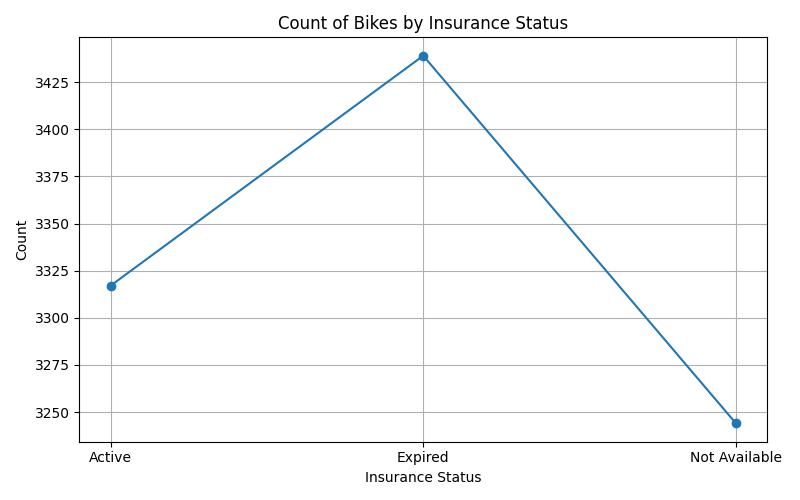

**Objective**: To visualize the number of bikes based on their insurance status, highlighting coverage distribution across the dataset.

### 9. Sales Trend by Registration Year
Line chart tracking sales patterns over time.

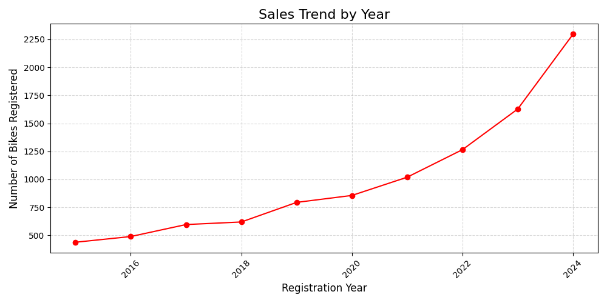

**Objective**: To track how bike registrations (sales) have changed over time, revealing demand trends or dips across years.

### 10. Bike Price Distribution by City Tier
Box plot comparing prices across different city tiers.

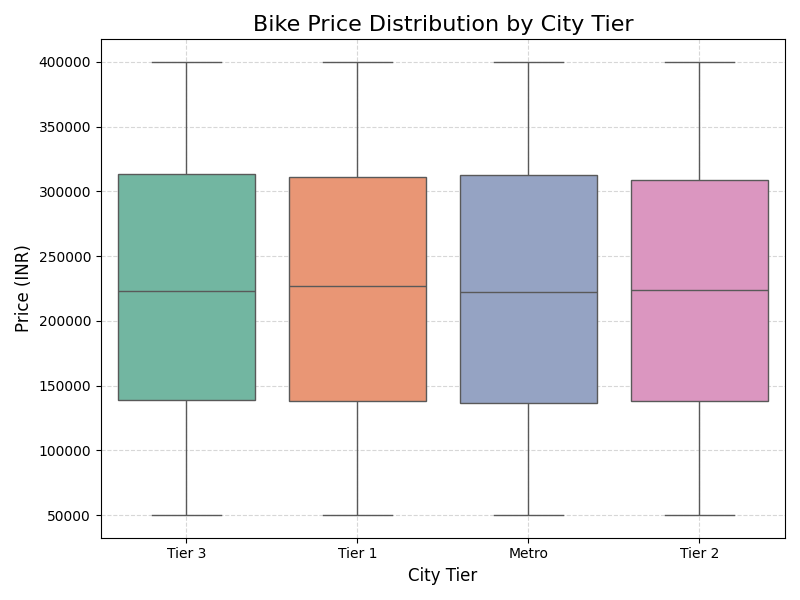

**Objective**: To compare bike price ranges in different tiers of cities, reflecting how location influences pricing.

### 11. Price vs Resale Price Correlation
Scatter plot examining relationship between original and resale prices.

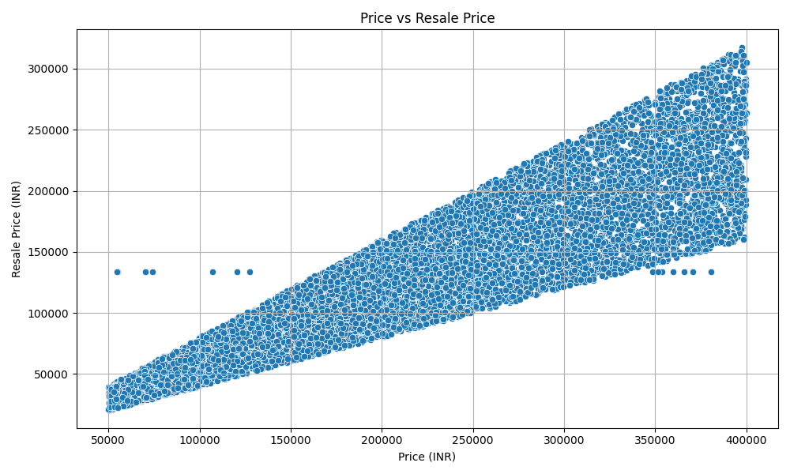

**Objective**: To explore the relationship between original price and resale price, identifying patterns in value retention across price segments.

### 12. Fuel Type Trends Over Years
Grouped bar plot showing fuel type popularity changes.

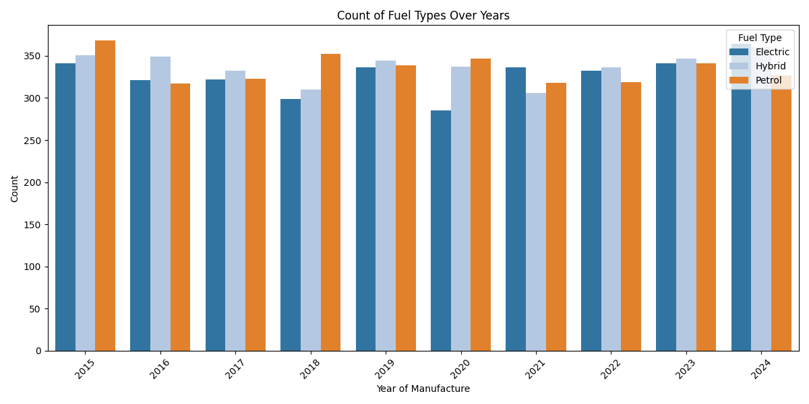

**Objective**: To track how the usage of different fuel types in bikes has changed over the years, revealing shifts toward or away from certain fuel types (e.g., electric).

### 13. Pairplot of Numeric Features
Multi-dimensional analysis of selected numeric variables.


**Objective**: To analyze relationships and distributions among selected numeric features, while observing how they vary across years of manufacture.

### 14. Average Price by Brand
Horizontal bar chart comparing brand pricing strategies.

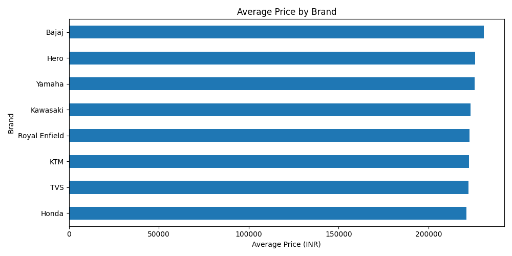

**Objective**: To compare the average bike price among brands, providing insight into brand positioning (budget vs premium).

## Outlier Detection
The analysis identifies outliers in numeric columns using the Interquartile Range (IQR) method, which helps ensure model robustness.

## Predictive Modeling
A linear regression model predicts bike resale prices based on the original price:

1. Data normalization using MinMaxScaler
2. Train-test split (95%-5%)
3. Model training and evaluation using Mean Squared Error
4. User-friendly prediction function for estimating resale values

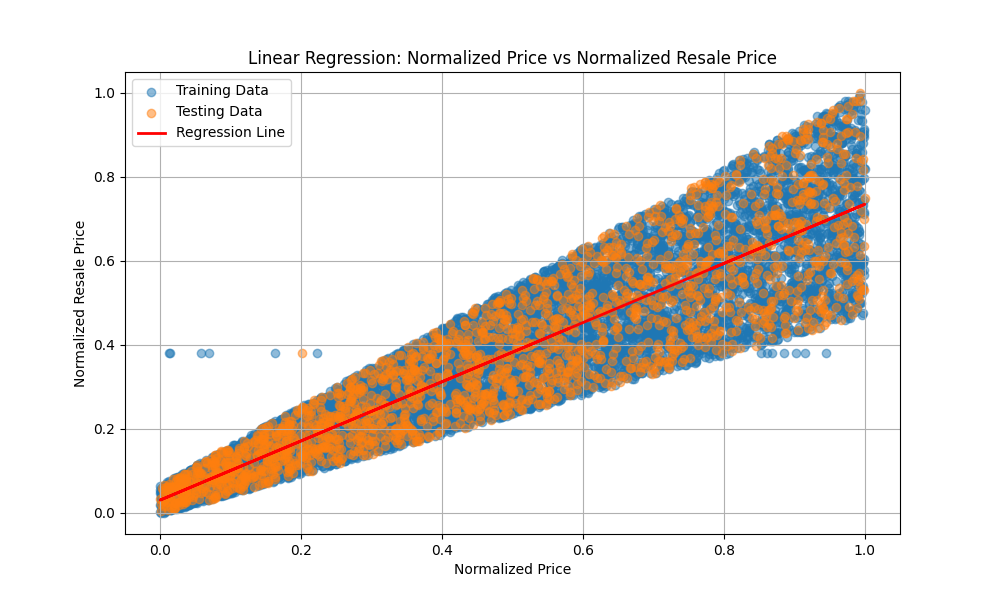

## How to Use
1. Install required libraries: `pip install pandas numpy matplotlib seaborn scikit-learn`
2. Update the file path in the code to match your dataset location
3. Run the script to generate visualizations and the predictive model
4. Use the interactive function to predict resale values for specific bike prices

## Future Improvements
- Implement multivariate regression to incorporate more factors in resale predictions
- Explore non-linear models for potentially better prediction accuracy
- Add cross-validation for more robust model evaluation
- Develop a web interface for interactive predictions

## Technologies Used
- *Python 3.x*
- *Pandas* for data manipulation
- *Matplotlib* and *Seaborn* for data visualization
- *Scikit-learn* for machine learning implementation

